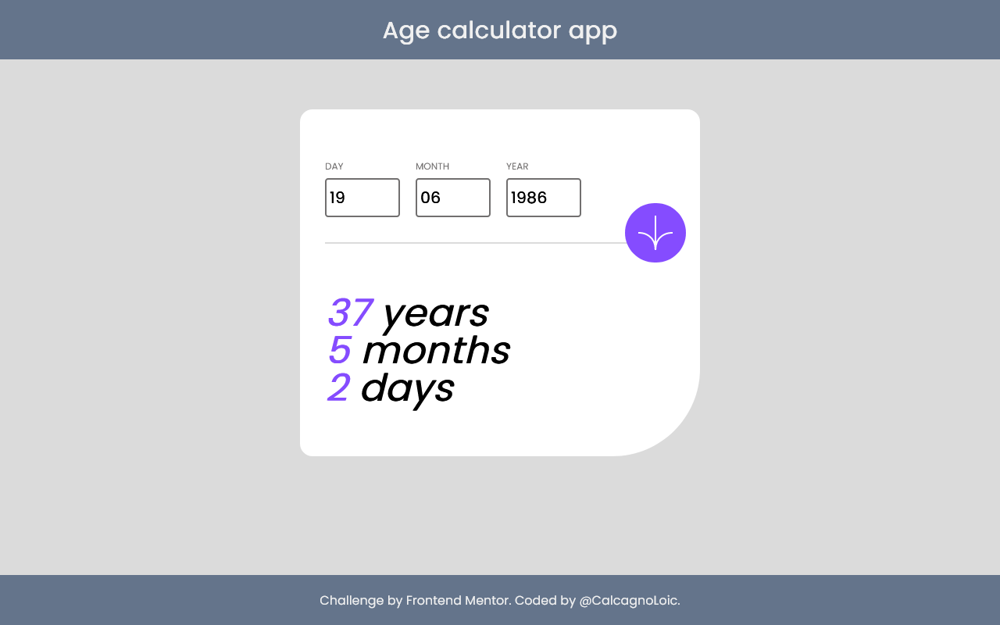

# Frontend Mentor - Age calculator app

  

  

## User stories

Your users should be able to:

- [x] View an age in years, months, and days after submitting a valid date through the form
- [x] Receive validation errors if:

  - [x] Any field is empty when the form is submitted
  

      
  

  - [x] The day number is not between 1-31
  

          
  

  - [x] The month number is not between 1-12
  

          
  

  - [x] The date is in the future
  

      
  

  
  - The date is invalid e.g. 31/04/1991 (there are 30 days in April)

- [x] View the optimal layout for the interface depending on their device's screen size
- [x] See hover and focus states for all interactive elements on the page
